## 跨域解决方案

跨域是web开发过程中经常会遇见的一种问题，因为javascript的同源策略的限制，a.com域名下是无法操作b.com下的对象或者调用接口的。

- 什么情况算跨域？
<table>
	<tr>
		<th>request url</th>
		<th>response url</th>
		<th>说明</th>
		<th>是否允许通讯</th>
	</tr>
	<tr>
		<td style="padding: 3px 10px;text-align: center;">www.a.com/a.js</td>
		<td style="padding: 3px 10px;text-align: center;">www.a.com/b.js</td>
		<td style="padding: 3px 10px;text-align: center;">同一域名</td>
		<td style="padding: 3px 10px;text-align: center;">允许</td>
	</tr>
	<tr>
		<td style="padding: 3px 10px;text-align: center;">www.a.com/a.js</td>
		<td style="padding: 3px 10px;text-align: center;">www.a.com:8080/b.js</td>
		<td style="padding: 3px 10px;text-align: center;">同一域名，端口不同</td>
		<td style="padding: 3px 10px;text-align: center;">不允许</td>
	</tr>
	<tr>
		<td style="padding: 3px 10px;text-align: center;">http://www.a.com/a.js</td>
		<td style="padding: 3px 10px;text-align: center;">https://www.a.com/b.js</td>
		<td style="padding: 3px 10px;text-align: center;">同一域名，协议不同</td>
		<td style="padding: 3px 10px;text-align: center;">不允许</td>
	</tr>
	<tr>
		<td style="padding: 3px 10px;text-align: center;">www.a.com/a.js</td>
		<td style="padding: 3px 10px;text-align: center;">blog.a.com/b.js</td>
		<td style="padding: 3px 10px;text-align: center;">一级域名相同，二级域名不同</td>
		<td style="padding: 3px 10px;text-align: center;">不允许</td>
	</tr>
	<tr>
		<td style="padding: 3px 10px;text-align: center;">www.a.com/a.js</td>
		<td style="padding: 3px 10px;text-align: center;">www.b.com/b.js</td>
		<td style="padding: 3px 10px;text-align: center;">不同域名</td>
		<td style="padding: 3px 10px;text-align: center;">不允许</td>
	</tr>
</table>

 

目前解决跨域的方法比较多，通常有iframe、动态创建script、document.domain、flash、jsonp、cors、postMessage这几种。但本文只给出`jsonp`、`cors`与`postMessage`三种的测试例子。

 

## 测试环境
- node.js  ~0.12.0
- express  ~4.12.1
- jade     ~1.9.2

 

## 1. JSONP

JSONP跟JSON是什么关系？JSONP的实现原理是什么？我就不造轮子了，因为我也是看了别人的文章才理解的，直接推荐一篇[讲得很清晰的博文](http://kb.cnblogs.com/page/139725/)。了解后，就开始本地的代码测试吧。

#### 本地模拟跨域

本地要模拟跨域，一开始我是通过使用node启动一个地址为127.0.0.1:3000的server，然后本地在配一个frend.com（这个是nginx启动的一个静态资源server，端口是80，host配置中指向127.0.0.1）。然而这个在调试的过程中居然不跨域，普通的ajax请求居然通过了，这个我也不太理解。
 

既然上面的情况不算跨域，那我只能起两个不同端口的server了。所以我在本地起了两个基于node的server，但端口分别为3000和3001，来实现跨域。以下就是通过两个端口不一样的服务来测试jsonp解决跨域的方案：

- server1: localhost:3001，作为响应端

响应端代码：

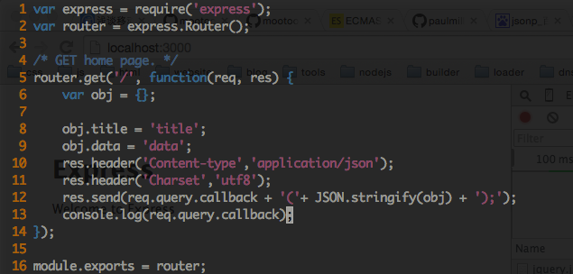

响应端启动log：

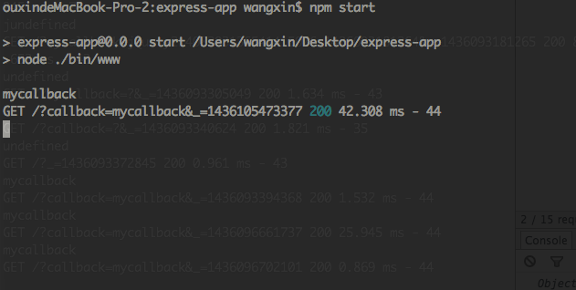

- server2: localhost:3000，作为请求端

请求端代码：

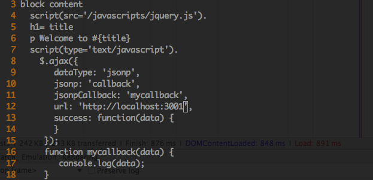

请求端启动log：

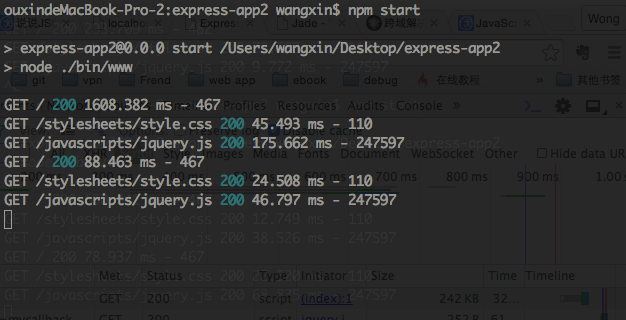

- 浏览器访问localhost:3000，响应如下：

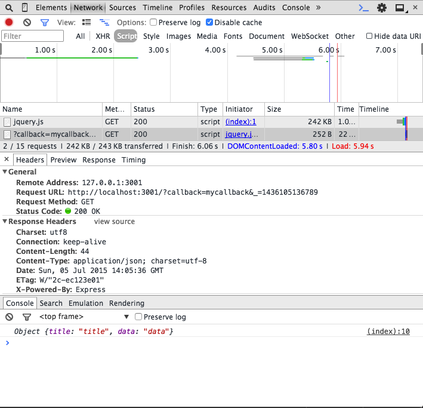

 

[☞下载JSONP例子源码☜](https://github.com/FrendEr/Cross-Origin)

#### JSONP总结

JSONP实现的原理很简单而且使用jquery的api会非常的方便，只需要配合后台定义好的接口。但是也有缺点，就是只支持GET的请求方式，如果需要使用POST或者传输大量的数据的时候，那我们就只能选择其他方式了，例如下面介绍的[CORS](#CORS)。

 

## 2. CORS

CORS(Cross-Origin Resource Sharing)即跨域资源共享，也是一种实现跨域访问的方法。

CORS的实现原理很简单，只需要在响应端的头信息配置一个`Access-Control-Allow-Origin`的响应信息即可。

- a) 没有配置`Access-Control-Allow-Origin`时，http://localhost:3000向http://localhost:3001发起ajax请求，跨域请求失败。

- b) 设置`Access-Control-Allow-Origin: http://localhost:3000`：

响应代码：

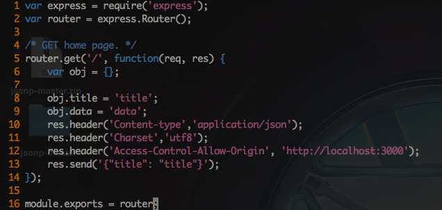

请求代码：

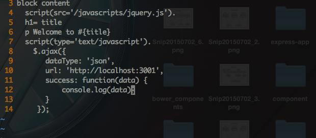

浏览器访问http://localhost:3000，响应如下：

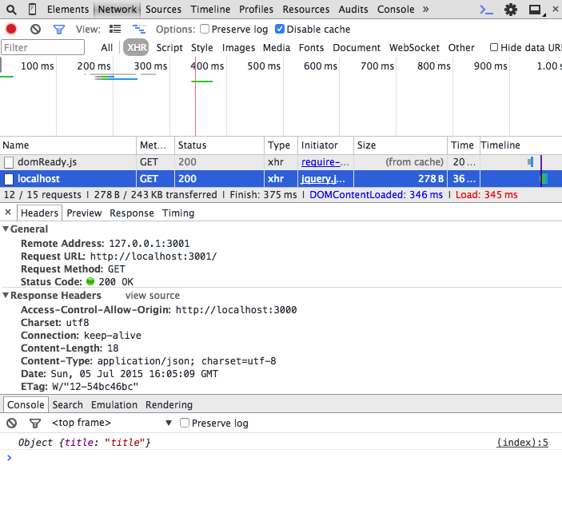

- c) 设置`Access-Control-Allow-Origin: *`，注意这里的`*`是指所有来源都可以调用该接口：

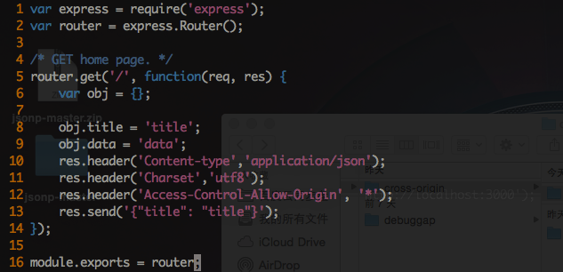

请求代码：

浏览器访问http://localhost:3000，响应如下：

[☞下载CORS例子源码☜](https://github.com/FrendEr/Cross-Origin)

 

#### CORS总结

CORS在使用起来非常方便，但也有缺点。

- ① 兼容性，下图可见，对于需要兼容IE6-7的网站来说，这种方案还是存在着不满足需求的情况。但是对于现代浏览器，特别是在移动端可以放心使用。

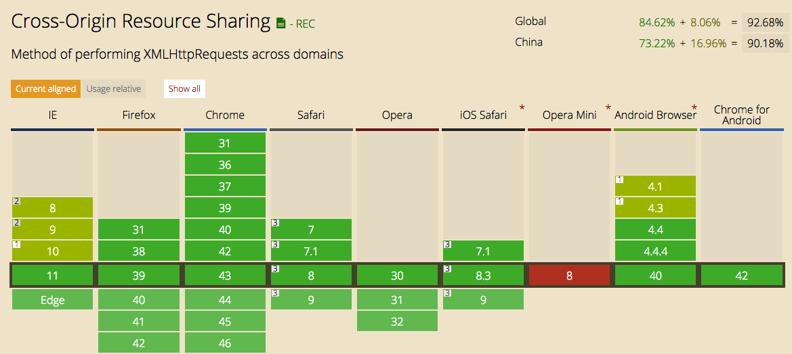

- ② 安全性

CORS提供了一种简易的跨域请求方案，但是并没有为安全访问提供足够的保障机制，例如上面`Access-Control-Allow-Origin: *`的情况，所有使用者都可以请求改接口，这给服务端带来了巨大的安全隐患。如果需要保障安全，请参考[OAuth2](http://www.ruanyifeng.com/blog/2014/05/oauth_2_0.html)。

 

## 3. postMessage

postMessage是html5引入的message的API，可以更加方便、有效、安全的解决iframe嵌套跨域问题。详情见[postMessage使用文档 - MDN](https://developer.mozilla.org/zh-CN/docs/Web/API/Window/postMessage)。

- 主页面

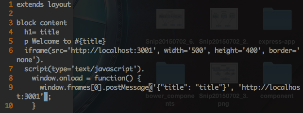

- iframe页面

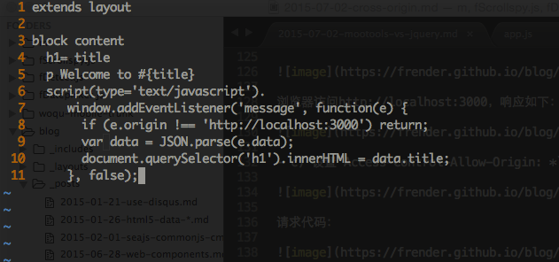

- 浏览器访问http://localhost:3000，响应如下：

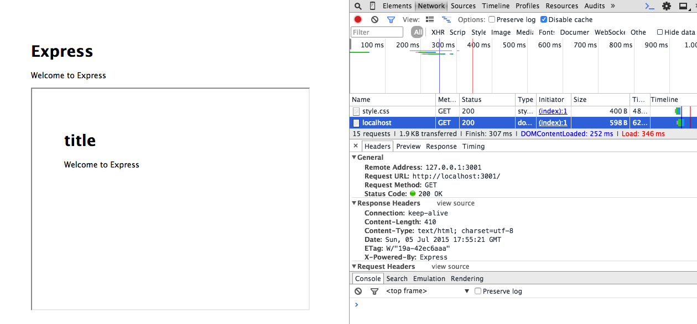

[☞下载postMessage例子源码☜](https://github.com/FrendEr/Cross-Origin)

 

## postMessage总结

postMessage使用非常简单，但是在浏览器支持上对于IE6-7存在不足，如下图：

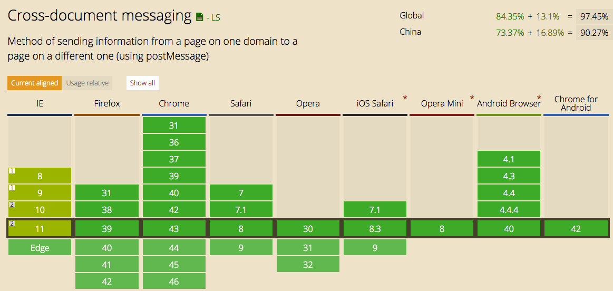

但是现代浏览器对于使用postMessage还是非常有效的，特别是在移动端。
